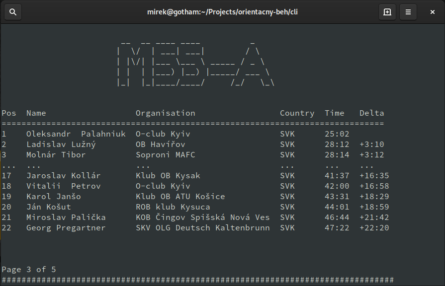

# Konzolový klient

Treba nastaviť príznak na spúšťanie:

```bash
chmod +x client.sh
```

Použitie:

```bash
./client.sh
```


## Nastavenie

V skripte sa nachádza niekoľko premenných:

* `REPO` - Umiestnenie priečinka, do ktorého sa budú sťahovať záznamy z internetu. Tento priečinok sa nemaže a teda stiahnuté súbory v ňom zostávajú.
* `URL` - URL adresa, z ktorej sa stiahne CSV súbor s výsledkami.
* `HEADER` - Zoznam položiek hlavičky.
* `DELAY` - Čas v sekundách, ako dlho sa bude zobrazovať jedna stránka výsledkov.


## Screenshot


